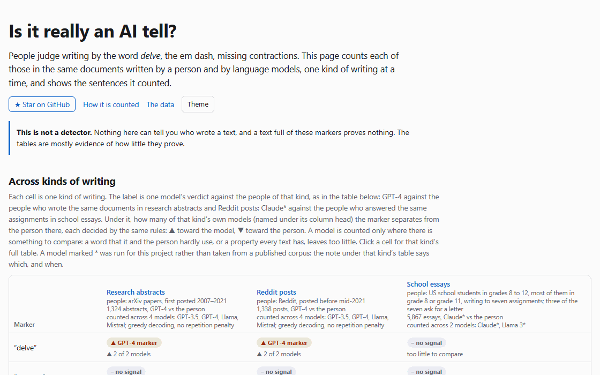

# Is it really an AI tell?

People can tell you what gives away machine-written text. The em dash. The word *delve*. No contractions. Every list has three items.

Almost none of it is measured. This project counts each marker in three kinds of writing. Research abstracts and Reddit posts were each written once by a person and again by GPT-3.5, GPT-4, Llama chat and Mistral chat, given the same title. School essays were written by US students to seven assignments, and the same assignments were given here to Claude and to Llama 3. The markers are also counted in casual and careful human writing from before ChatGPT existed. It publishes the rates, the intervals and a placebo column, so a marker can be argued with instead of repeated. Each kind of writing is measured on its own, and the answers differ between them.

**[Open the page →](https://barbarkaragul-oss.github.io/is-it-really-an-ai-tell/)** It has the grid across the three kinds of writing, every number below with the sentences behind it, one document written by every writer, and a box to paste your own text into. Nothing you paste leaves the browser.

[](https://barbarkaragul-oss.github.io/is-it-really-an-ai-tell/)

> This is not a detector. It cannot tell you who wrote anything, and a text full of markers proves nothing. There is no score, because the numbers do not support one. If software has accused you of something, the useful evidence points the other way: detector software has a documented record of calling genuine human writing machine-written, and essays by non-native English writers are the clearest case ([Liang et al., Patterns 2023](https://doi.org/10.1016/j.patter.2023.100779)).

## The findings

Each row below is a marker, and each column one kind of writing. A cell starts with GPT-4's verdict against the person who wrote the same documents (see [How the counting is done](#how-the-counting-is-done)). Next comes how many of the four RAID models (GPT-3.5, GPT-4, Llama chat, Mistral chat) the marker separates from the person in that kind of writing, each model judged by the same rule: ▲ means it points to the model, ▼ to the person. “of n” counts the models that had enough to compare, and “none comparable” means no model did. School essays have two writers instead of four, both run here: their cell starts with the verdict for Claude, told it is a student, against the students who answered the same assignments, and counts over Claude and Llama 3 ([below](#school-essays)). The numbers come from [`data/summary.json`](data/summary.json).

| marker | research abstracts | Reddit posts | school essays |
|---|---|---|---|
| “delve” | machine marker · ▲2 of 2 | machine marker · ▲2 of 2 | no signal · none comparable |
| “tapestry” | no signal · none comparable | no signal · none comparable | no signal · none comparable |
| “moreover” | **points the other way · ▼4 of 4** | **machine marker · ▲2 of 2** | no signal · ▲1 of 2 |
| “furthermore” | register marker · ▲1 ▼1 of 4 | no signal · ▲2 of 4 | **points the other way · ▲1 ▼1 of 2** |
| “crucial” | machine marker · ▲4 of 4 | machine marker · ▲3 of 4 | **points the other way · ▲1 ▼1 of 2** |
| “realm” | no signal · 0 of 2 | no signal · 0 of 4 | no signal · 0 of 2 |
| “showcase” | no signal · 0 of 4 | no signal · ▲1 of 3 | no signal · ▲1 of 2 |
| “underscores” | no signal · 0 of 1 | no signal · none comparable | no signal · none comparable |
| “leverage” as a verb | **machine marker · ▲4 of 4** | **no signal · none comparable** | no signal · none comparable |
| “it is important to note” / “worth noting” | no signal · none comparable | **machine marker · ▲3 of 4** | no signal · none comparable |
| “in today’s …” | no signal · none comparable | no signal · 0 of 1 | no signal · ▲1 of 2 |
| “not only … but also” | register marker · ▼2 of 4 | **machine marker · ▲3 of 4** | **points the other way · ▲1 ▼1 of 2** |
| “it’s not X, it’s Y” | no signal · none comparable | no signal · 0 of 4 | machine marker · ▲1 of 2 |
| “dive into” / “let’s explore” | no signal · none comparable | no signal · 0 of 2 | no signal · none comparable |
| “in conclusion” / “in summary” / “to sum up” | no signal · 0 of 1 | **machine marker · ▲3 of 4** | **points the other way · ▲1 ▼1 of 2** |
| every sentence the same length | machine marker · ▲4 of 4 | machine marker · ▲3 of 4 | **points the other way · ▲1 ▼1 of 2** |
| a dash, however it is typed | **points the other way · ▼4 of 4** | **no signal · ▲1 of 4** | no signal · 0 of 2 |
| two or more dashes | no signal · 0 of 2 | no signal · 0 of 2 | no signal · none comparable |
| a three-item list | machine marker · ▲3 of 4 | machine marker · ▲4 of 4 | **points the other way · ▲1 ▼1 of 2** |
| a bulleted list with bold lead-ins | no signal · none comparable | not recorded | no signal · none comparable |
| no contractions at all | register marker · none comparable | **points the other way · ▲1 ▼2 of 4** | machine marker · ▲2 of 2 |
| no first person | register marker · 0 of 1 | no signal · ▲1 ▼1 of 4 | points the other way · ▼1 of 2 |
| no personal detail | register marker · none comparable | **machine marker · ▲4 of 4** | points the other way · ▼1 of 2 |
| no informal spelling | register marker · none comparable | **machine marker · ▲4 of 4** | no signal · 0 of 2 |
| Title Case headings | no signal · none comparable | not recorded | no signal · none comparable |

**A tell depends on the kind of writing.** In research abstracts, 5 of the 25 markers are machine markers for GPT-4. In Reddit posts, 10 are. GPT-4's verdict changes between the two kinds for 11 markers, and two more cannot be recorded for posts at all. “Moreover” points to the person in abstracts and to the model in posts. “Leverage” separates all four models from the person in abstracts, and in posts the five writers use it 4 times between them. “In conclusion” and “it is important to note” give no signal in abstracts, and “not only … but also” is a register marker there. In posts, all three separate three of the four models from the person. The dash points to the person in abstracts and, for GPT-4, to nobody in posts. Four markers are machine markers for GPT-4 in both: “delve”, “crucial”, even sentence lengths and three-item lists. Between these two kinds of writing, GPT-4's verdict on a marker in one did not reliably predict its verdict in the other, so nothing here should be read as a verdict on a kind that was not measured. Those kinds are listed in [What is not covered](#what-is-not-covered). School essays show the same thing inside a single kind: on six markers one of its two models writes the marker more often than the students and the other less often ([below](#school-essays)).

The placebo, which splits each kind's human texts at random and runs the same tests on both halves, ties on every row: 25 of 25 in abstracts, all 23 tested rows in posts, and every row in school essays, where the two halves are cut to the size of the comparison beside them.

### Research abstracts

Occurrences per thousand words on the full arms, with the count in brackets. RAID gave each model the title of a real paper, and the paper's published abstract is the person's text. After the checks in [How the counting is done](#how-the-counting-is-done), the person and GPT-4 have 1,324 abstracts, GPT-3.5 has 1,297, Llama chat 1,013 and Mistral chat 1,035. The last column is how many of the four models the marker separates from the person ([`data/genres/abstracts/markers.json`](data/genres/abstracts/markers.json)).

| marker | human | GPT-3.5 | **GPT-4** | Llama chat | Mistral chat | verdict for GPT-4 | models |
|---|---|---|---|---|---|---|---|
| **“delve”** | 0.00 (0) | 0.01 (2) | **0.97 (141)** | 0.06 (16) | 0.00 (0) | machine marker | ▲2 of 2 |
| “leverage” as a verb | 0.30 (71) | 2.00 (316) | 2.34 (340) | 1.60 (440) | 0.89 (123) | machine marker | ▲4 of 4 |
| “crucial” | 0.19 (46) | 0.75 (119) | 0.79 (115) | 0.57 (156) | 1.10 (151) | machine marker | ▲4 of 4 |
| a three-item list | 1.62 (389) | 2.00 (316) | 5.29 (769) | 4.76 (1,305) | 2.80 (385) | machine marker | ▲3 of 4 |
| “furthermore” | 0.33 (80) | 0.38 (60) | 0.36 (52) | 0.36 (98) | 0.03 (4) | register marker | ▲1 ▼1 of 4 |
| **“moreover”** | **0.44 (105)** | 0.00 (0) | 0.00 (0) | 0.07 (19) | 0.00 (0) | points the other way | ▼4 of 4 |
| “in conclusion” / “in summary” / “to sum (it) up” | 0.01 (3) | 0.01 (1) | 0.00 (0) | **0.30 (81)** | 0.00 (0) | no signal | 0 of 1 |
| **a dash, however it is typed** | **0.31 (75)** | 0.00 (0) | 0.03 (5) | 0.02 (5) | 0.00 (0) | points the other way | ▼4 of 4 |

**“Delve” is mostly a GPT-4 word.** GPT-4 writes it 0.97 times per thousand words (141 occurrences). Llama writes it 0.06 times (16), GPT-3.5 twice, and Mistral and the people writing the same documents never. On the documents where GPT-4 and the person wrote abstracts of similar length, 43 of GPT-4's 222 use it and none of the person's do. Llama's 16 are enough for its own comparison to separate it from the person too (q = 0.027). So the word marks two of the four models, and nearly all of it comes from one. Most of what is written about that word describes GPT-4.

**“Moreover” is a human word in abstracts.** A person writes it 0.44 times per thousand words (105 occurrences, in 102 of the 1,324 abstracts, 7.7%). GPT-3.5, GPT-4 and Mistral never write it, and Llama writes it 0.07 times per thousand. All four models' own comparisons point the same way, toward the person. In Reddit posts the word turns around ([below](#reddit-posts)).

**“In conclusion” belongs to Llama, but only by rate.** Llama writes it 0.30 times per thousand (81 occurrences: 56 “in summary” and 25 “in conclusion”). GPT-3.5 writes it once, GPT-4 and Mistral never, and the person writing the same documents 3 times. Yet Llama's own comparison with the person gives no signal (q = 0.30). Llama writes long abstracts (a median of 277 words, against 176 for the person), few of the person's abstracts are that long, and the test only compares texts of about the same length. “Belongs to Llama” describes the whole column, not a difference the test can confirm.

**“Leverage” as a verb and “crucial” are the words that hold across the four RAID models.** All four write “leverage” more often than the person writing the same document: from 0.89 (Mistral) to 2.34 (GPT-4) per thousand, against 0.30. They write “crucial” from 0.57 (Llama) to 1.10 (Mistral), against 0.19. Every RAID model's interval sits above the person's on both words, and each model's own comparison separates it. In Reddit posts “leverage” is too rare to compare, and “crucial” holds for three of the four models. The Claude arm does not follow them (see [its section](#a-claude-arm-generated-here)).

**“Furthermore” belongs to the kind of writing, not to the machine.** The person and three of the models write it at about the same rate (0.33–0.38 per thousand), while casual and careful writing barely use it (0.02 and 0.03). GPT-4's verdict is register marker. The other models split: GPT-3.5's own comparison separates it toward the model, and Mistral's, which almost never writes it (0.03), toward the person.

**GPT-4 and Llama write about three times as many three-item lists as the person** (5.29 and 4.76 per thousand, against 1.62). GPT-3.5 is close to the person (2.00), and its own verdict is register marker. People write these lists everywhere: 1.22 per thousand in casual writing and 1.55 in careful writing. Some of what this count catches is a template; see below.

**The dash points the other way.** Counted however it is typed, the people use dashes and the four RAID models barely do. The 1,324 human abstracts hold 75 dashes (0.31 per thousand, in 51 abstracts), and not one of them is the “—” character. RAID's abstracts come from TeX: of those 75, 33 are a hyphen with spaces around it, 23 are “--” and 19 are “---”. Between them, the four RAID models wrote 10 dashes in 4,669 abstracts (GPT-4 5, Llama 5, GPT-3.5 and Mistral none), all of them spaced hyphens. Across the four models' 1,284 document pairs, the model's abstract has a dash in 2 and the person's in 58. Compared at equal lengths, GPT-4 has 5 of the dashes where equal habits would have given it about 11. This is the closest call in the table: q = 0.040, against a cut-off of 0.05. The dash is mostly about the kind of writing. Casual writing uses 2.12 per thousand and careful writing 1.94, more than six times the abstracts' rate. The Claude arm writes more dashes than the person, on few texts; see [its section](#a-claude-arm-generated-here).

### Reddit posts

RAID gave each model the title of a real Reddit post and had it write the post. The people's posts are from before mid-2021. RAID took them from a 2021 file of a Pushshift-based dataset ([sentence-transformers/reddit-title-body](https://huggingface.co/datasets/sentence-transformers/reddit-title-body)), which was not filtered for bots or spam. The people's posts are counted and never quoted, here or on the page, and their titles are not shown. After the checks, the person has 1,338 posts, GPT-3.5 1,297, GPT-4 1,330, Llama chat 878 and Mistral chat 1,204 ([`data/genres/posts/markers.json`](data/genres/posts/markers.json)). Occurrences per thousand words, with the count in brackets:

| marker | human | GPT-3.5 | **GPT-4** | Llama chat | Mistral chat | verdict for GPT-4 | models |
|---|---|---|---|---|---|---|---|
| “in conclusion” / “in summary” / “to sum (it) up” | 0.00 (1) | 0.19 (38) | **0.25 (75)** | 0.04 (8) | 0.15 (31) | machine marker | ▲3 of 4 |
| “not only … but also” | 0.01 (2) | 0.33 (66) | **0.16 (46)** | 0.06 (13) | 0.07 (14) | machine marker | ▲3 of 4 |
| “it is (also) important to note” / “worth noting” | 0.00 (0) | 0.07 (13) | **0.05 (16)** | 0.03 (6) | 0.21 (42) | machine marker | ▲3 of 4 |
| **“moreover”** | 0.00 (1) | 0.07 (13) | **0.14 (40)** | 0.00 (0) | 0.00 (0) | machine marker | ▲2 of 2 |
| “crucial” | 0.01 (2) | 0.53 (105) | **0.18 (53)** | 0.04 (8) | 0.07 (15) | machine marker | ▲3 of 4 |
| “delve” | 0.00 (0) | 0.06 (12) | **0.04 (12)** | 0.00 (1) | 0.00 (0) | machine marker | ▲2 of 2 |
| a three-item list | 1.00 (238) | 2.74 (543) | **3.77 (1,110)** | 2.02 (419) | 3.10 (633) | machine marker | ▲4 of 4 |
| “furthermore” | 0.03 (6) | 0.22 (43) | **0.05 (14)** | 0.04 (9) | 0.09 (18) | no signal | ▲2 of 4 |
| **“leverage” as a verb** | 0.00 (1) | 0.01 (2) | **0.00 (0)** | 0.00 (1) | 0.00 (0) | no signal | none comparable |
| **a dash, however it is typed** | 0.28 (68) | 0.23 (45) | **0.44 (130)** | 0.66 (138) | 0.19 (39) | no signal | ▲1 of 4 |

**In posts, the machine marker is essay scaffolding.** The phrases that organise an essay are close to absent from the people's posts. In 239,051 words, the people wrote “in conclusion” once, “moreover” once, “not only … but also” twice and “it is important to note” never. GPT-4 wraps up with “in conclusion” or “in summary” 75 times, and GPT-3.5 writes “not only … but also” 66 times. Mistral writes “it is important to note” 42 times, and GPT-4 writes “moreover” 40 times. Llama is the exception: its own comparison with the person separates on none of these four.

**“Moreover” turns around.** In abstracts the people write it and GPT-4 never does. In posts GPT-4 writes it 40 times and the people once (at equal lengths, 39 where equal habits would give about 28). The same model that never puts the word in an abstract puts it in a Reddit post.

**The hedging phrase is back, at a low rate.** In abstracts, RAID's GPT-3.5 never writes “it is important to note”, which is what [the earlier correction](#a-correction-worth-stating-plainly) rests on. In posts it writes the phrase 13 times (0.07 per thousand), GPT-4 16 times and Mistral 42 times (0.21). The people never write it, so three of the four models separate from them. That is still far below GPT-3.5 answering questions in HC3 (0.65).

**“Leverage” disappears, “crucial” holds, and “delve” barely does.** The five writers use “leverage” 4 times between them in about 1.1 million words, too few to compare anyone. “Crucial” separates GPT-3.5 (0.53), GPT-4 (0.18) and Mistral (0.07) from the person (0.01, 2 occurrences). Llama's 8 do not. “Delve” is a machine marker for GPT-3.5 and GPT-4, but GPT-4 writes it about 24 times less often in a post (0.04) than in an abstract (0.97), and its verdict only just clears the cut-off (q = 0.038).

**Three-item lists separate all four models.** GPT-4 writes 3.77 per thousand against the person's 1.00. The people write fewer lists in their posts than in their abstracts (1.62).

**The dash does not point anywhere for GPT-4.** The people wrote 68 dashes (0.28 per thousand), GPT-4 130 (0.44) and Llama 138 (0.66). Only Llama's comparison separates it from the person. At equal lengths GPT-4 has 126 dashes where equal habits would give about 111 (q = 0.12). This verdict depends on a counting step. On Reddit, people often type a dash as a hyphen stuck to the word before it, or as “--” between two words. The collector turns both into a spaced dash in every writer's post before counting ([Corrections, 17 September](#corrections-17-september), point 7).

**The belief markers finally say something, but little about one post.** In abstracts nobody writes personal detail or informal spelling. In posts, the people do and the models mostly do not, and all four models separate. On GPT-4's documents, 91.6% of its posts have no personal detail (“my friend”, “last year”, “when I was”), against 79.4% of the person's. 99.7% of its posts have no informal spelling (“gonna”, “tbh”), against 83.6%. But 81.4% of all the people's posts also have no personal detail, and 83.9% no informal spelling. Since most human posts lack both, their absence cannot tell you much about any single post.

**Contractions point the other way.** The belief is that machine text avoids contractions. In posts, GPT-4 goes without them in 1.2% of its posts and Llama in 1.4%, against 5.6% and 5.8% for the person on the same documents: both models use contractions more. GPT-3.5 does not separate from the person. Mistral does go without more often (15.6% against 8.3%), so for Mistral the belief holds.

**Mistral writes about the poster more than as the poster.** On the paired documents, 35.5% of its posts have no “I”, “my” or “me”, against 4.5% of the person's posts. It often explains the title's subject or talks to the reader instead. The other models write in the first person as the people do, and GPT-3.5 does so slightly more often than the person.

**Even sentence lengths hold, with a smaller gap.** 36.1% of GPT-4's posts have every sentence about the same length, against 23.9% of the person's on the same documents. GPT-3.5 (78.9%) and Mistral (75.0%) are far more even, and Llama (32.1%) does not separate. GPT-4 also writes longer posts than the person (a median of 218 words against 167), the opposite of abstracts (109 against 176).

### School essays

The third kind of writing is built differently, and the difference matters for how to read it. There is no shared document here. US school students answered seven assignments, and Claude and Llama 3 were given the same seven assignments. A model's essay is compared with a student's essay on the same assignment and of about the same length, not with a rewrite of the same text, so these pairs are looser than the ones in abstracts and posts.

**The students.** 5,867 essays from the [PERSUADE 2.0](https://github.com/scrosseye/persuade_corpus_2.0) corpus, written to the seven assignments that need no reading passage, mostly in grade 8 (4,101) and grade 11 (1,342). Three of the seven assignments ask for a letter to the principal. Every essay used here was in the Kaggle Feedback Prize release of December 2021, a year before ChatGPT, and that is checked essay by essay against the official file ([`data/genres/essays/kaggle-2021.json`](data/genres/essays/kaggle-2021.json)). The corpus is CC BY-NC-SA 4.0. The students' essays are counted and never published: no essay, sentence or name of theirs is in this repository or on the page.

**The machine side was written here, and this is the part to be skeptical of.** Three public sets pair student essays with model essays, and none could be used. [OUTFOX](https://github.com/ryuryukke/OUTFOX) sampled its models at temperature 1.3, and most of its essays turn into word salad before they end. [Ghostbuster](https://github.com/vivek3141/ghostbuster-data)'s human essays were published in December 2022 and January 2023, after ChatGPT, so its human column cannot be shown to be human. [ArguGPT](https://github.com/huhailinguist/ArguGPT) does not release its human essays. So each assignment was given, with nothing else, to:

- **Claude*** (Claude Opus 5 through Claude Code), told it is a student in the assignment's grade: 200 essays. This is the verdict column.
- **Llama 3*** (Llama 3 8B, run on a local machine through Ollama at temperature 1), told the same: 200 essays. It is the one writer in this kind the project did not author.
- **Claude plain*** (the same Claude, given the assignment alone): 200 essays, shown beside the others and kept out of every test, so you can see what the student framing moves.

The prompt says nothing about length, style or format, and no student's text is in it. Each essay was written in its own session. Every essay is committed with the exact prompt it was given, the model, the date and a hash ([`data/generated/claude-essays`](data/generated/claude-essays), [`data/generated/llama3-essays`](data/generated/llama3-essays)). The essays cannot be regenerated word for word: Ollama returned different essays for the same prompt and seed, and Claude Code does not expose its sampling settings. What can be repeated is the measurement, from the essays as committed. The same assistant that wrote these essays also wrote this page, which is why their columns carry an asterisk.

After the checks, no essay was dropped from any arm. The check for remembered text asks whether a machine essay repeats the students' essays on the same assignment: on average 4.1% of a Claude essay's five-word sequences and 13.7% of a Llama essay's also occur somewhere in those essays, and none comes close to the 50% threshold. Occurrences per thousand words, with the count in brackets ([`data/genres/essays/markers.json`](data/genres/essays/markers.json)):

| marker | students | **Claude\*** | Llama 3\* | Claude plain\* | verdict for Claude | writers |
|---|---|---|---|---|---|---|
| “in conclusion” / “in summary” / “to sum (it) up” | 0.55 (1,368) | **0.01 (1)** | 2.51 (189) | 0.01 (1) | points the other way | ▲1 ▼1 of 2 |
| “not only … but also” | 0.11 (283) | **0.00 (0)** | 1.13 (85) | 0.00 (0) | points the other way | ▲1 ▼1 of 2 |
| “furthermore” | 0.09 (218) | **0.00 (0)** | 0.80 (60) | 0.00 (0) | points the other way | ▲1 ▼1 of 2 |
| “moreover” | 0.03 (68) | **0.00 (0)** | 0.42 (32) | 0.00 (0) | no signal | ▲1 of 2 |
| “crucial” | 0.05 (127) | **0.00 (0)** | 0.17 (13) | 0.00 (0) | points the other way | ▲1 ▼1 of 2 |
| a three-item list | 1.49 (3,683) | **0.81 (95)** | 4.67 (352) | 0.98 (112) | points the other way | ▲1 ▼1 of 2 |
| “it’s not X, it’s Y” | 0.00 (12) | **0.25 (29)** | 0.03 (2) | 0.24 (27) | machine marker | ▲1 of 2 |
| a dash, however it is typed | 0.01 (25) | **0.00 (0)** | 0.03 (2) | 0.05 (6) | no signal | 0 of 2 |

**The same marker points in opposite directions, in the same essays.** On six of the 25 markers, one of the two models writes it more than the students and the other less: “in conclusion”, “not only … but also”, “furthermore”, “crucial”, even sentence lengths and three-item lists. Llama 3 is the writer the checklists describe. It uses “in conclusion” or “in summary” in 94.5% of its essays (the students in 22.1%), writes “not only … but also” ten times as often as they do, and gives 69.0% of its essays sentences of about the same length (the students 33.7%). Claude, told it is a student, does almost none of it: one “in conclusion” in 200 essays, no “furthermore”, no “moreover”, no “crucial”, and even sentence lengths in 2.0% of its essays. On those markers a checklist would take the students for the machine.

**What Claude does instead is its own.** It writes “it’s not X, it’s Y” (“That’s not really getting advice, that’s shopping.”) 29 times, against 12 times in all 5,867 students' essays: 0.25 per thousand words against 0.00. That is its verdict as a machine marker, and Llama 3 does not share it. It also leaves out contractions more often than the students (35.2% of its essays have none, against 17.5%), which is the one marker both models agree on (▲2 of 2).

**The belief markers turn around.** The checklists say machine text lacks the first person and personal detail. Every Claude essay uses “I”, “my” or “me”; 24.9% of the students' essays do not. 14.3% of Claude's essays have no personal detail (“my friend”, “last year”, “when I was”), against 90.3% of the students'. Told it is a student, the model writes the way people imagine a student writes, with more first person and more small stories than the students did. Llama 3 matches the students on both. One caveat belongs here: the corpus removed the students' names from their essays, and the models sign their letters with invented ones (Claude) or leave “[Your Name]” (Llama 3), so nothing about names is compared.

**The student framing is not what makes Claude avoid the checklist.** Given the assignment alone, Claude plain avoids the same words (one “in conclusion” and no “furthermore”, “moreover” or “crucial” in 200 essays) and writes “it’s not X, it’s Y” just as often (0.24). The framing barely moves the belief markers either: without it, 1.5% of the essays have no first person and 17.0% no personal detail, against 0.0% and 14.3% with it.

**Read this kind of writing for what it can show.** These are two models, one of them this project's own assistant, writing in 2026 to assignments students answered before 2022, compared by assignment rather than by document. A difference between the columns can be the writer, the year or the model generation, and this kind cannot separate them. What it does show is that a checklist built from one model's habits can point the wrong way for another, on the same assignment. The placebo, split to the size of the comparison beside it, ties on every row.

### What the patterns actually caught

A rate says a pattern fired. [`data/genres/abstracts/evidence.json`](data/genres/abstracts/evidence.json) and [`data/genres/posts/evidence.json`](data/genres/posts/evidence.json) say what it fired on. For every countable marker and every arm, they list the forms that matched, the word in front of each match, and five sentences picked by a seeded shuffle rather than by anyone looking for good ones. Sentences are quoted from RAID's model texts (MIT), from the arXiv abstracts (CC0) and from the Claude arm. The people's Reddit posts are never quoted. Neither is a model's sentence that contains the whole title of its post, shares five words in a row with the person's post for the same document, or shares eight words in a row with any person's post or any post's title. A shorter run of a title's words can still appear in a quoted sentence. The casual and careful writing is linked to where it was posted, not quoted.

Reading them turned up three things the rates hid.

**In abstracts, the models make the paper the subject.** When the people who wrote these abstracts used “leverage”, 23% of the time it was “leverage**s**” (16 of 71). For all four RAID models it is 83–87%, and the word in front is usually *method*, *approach* or *that*: “the proposed method leverages”. “Delve” has the same shape: 124 of GPT-4's 141 are “delves”, and the word in front is most often *it* (39), *study* (35) or *paper* (26). The people write “we” 14.32 times per thousand words, against **1.59** for GPT-4 on the same documents. Llama and Mistral write “we” about as often as people do (15.41 and 12.72) and still write “leverages”, so the two habits are related but not the same. This is a habit of GPT-4's abstracts, not of GPT-4: in Reddit posts it writes “we” as often as the person (4.23 and 4.12 per thousand).

**GPT-4 repeats its lists of three.** “accuracy, robustness, and computational …” (usually *efficiency*) appears 30 times in its 1,324 abstracts, with “accuracy, robustness, and efficiency” (8) and “accuracy, efficiency, and robustness” (6) behind it. A second template is “computer vision, medical imaging, and remote sensing”, 14 times, and the same three in another order 10 more. Llama does the same (“diagnosis, treatment planning, and monitoring”, 20 times). No list in the person's abstracts appears more than twice. Those templates are 68 of GPT-4's 769 lists (8.8%). They are not the whole count, but part of what the list count measures there is a template rather than a rhythm.

**In posts, “crucial” follows “it's” and the dashes sit in prose.** Of GPT-3.5's 105 uses of “crucial”, the word in front is “it's” 40 times and “is” 38 times, so in a post the word mostly completes a statement rather than describing a noun. The models' dashes are almost all spaced hyphens inside sentences, not flattened list items, because list marks are taken off before counting. The person's 68 are 57 spaced hyphens, 6 “—” and 5 “--”.

Looking also fixed two labels, on 16 September. “Leverage” as a verb had been counting the noun as well, in a few online comments; that only ever touched the casual and careful writing, while every RAID match is the verb. The hedging phrase has always counted “worth noting” too, and its label now says so.

### Corrections, 17 September

Release 1 (commit `2061a21`, measured by the weekly run `d1cc1ff`) added Reddit posts and checked every text before counting it. The checks changed most abstracts numbers published on 16 September, though no GPT-4 verdict. This is what changed and why.

1. **Abstracts that may have been revised after ChatGPT are left out.** RAID's abstracts come from arXiv, where authors can post new versions of a paper. 172 of the 1,496 documents have an arXiv version posted between ChatGPT's release (2022-11-30) and the date of RAID's file (2024-06-04). The text RAID holds for them may be that later version. They are now left out of every column, the person's included. All 172 papers were first posted between 2007 and 2021, and their first version inside the window was posted on 30 November 2022 (1 paper), in December 2022 (8) or in 2023 (163). Every document was looked up in arXiv's records ([`data/abstracts-dates.json`](data/abstracts-dates.json)). 1,490 were dated; 6 could not be matched to a paper and are kept. The person's column went from 1,500 abstracts to 1,324.
2. **Model texts that are not the text asked for are dropped.** Before, every model text was counted. Now a text is dropped when it stops before it is finished, usually at the model's length limit, or when it is about the task instead of being the text (a refusal, a label, a note to the requester, a description of what the abstract would say). In abstracts, this dropped 191 cut-off Llama texts, 120 Llama and 289 Mistral texts that are not an answer, and 27 from GPT-3.5. None of GPT-4's texts were dropped. Llama's column fell from 1,500 texts (414,069 words) to 1,013 (274,256 words), and Mistral's from 1,500 to 1,035. Every arm's counts are in [`data/genres/abstracts/cleaning.json`](data/genres/abstracts/cleaning.json) and [`data/genres/posts/cleaning.json`](data/genres/posts/cleaning.json).
3. **The model rows are now chosen by their generation setting.** RAID has each model write each document several ways. The collector now keeps only rows written with greedy decoding and no repetition penalty, instead of taking the first row in the file. The document set selected under this rule is 1,496 rather than 1,500. This rule and points 1 and 2 came in the same run, and the published data does not separate their effects. Llama's and Mistral's numbers moved the most: Llama's “leverage” went from 1.49 to 1.60 per thousand, and its even-sentence share from 90.5% to 94.2%. Mistral's “crucial” went from 0.90 to 1.10, its “leverage” from 0.73 to 0.89, its “furthermore” from 0.06 to 0.03, its “we” from 11.80 to 12.72, and its even-sentence share from 94.5% to 99.4%.
4. **What moved in the published abstracts findings.** No GPT-4 verdict changed.

   | number | published 16 September | now |
   |---|---|---|
   | GPT-4 “delve” per thousand | 1.26 (207) | 0.97 (141) |
   | GPT-4 abstracts using “delve”, same documents as the person | 51 of 252 | 43 of 222 |
   | Llama “delve” per thousand | 0.07 (27) | 0.06 (16) |
   | Mistral “delve” per thousand | 0.01 (2) | 0.00 (0) |
   | “leverage”: four models, against the person | 0.73–2.14, against 0.27 | 0.89–2.34, against 0.30 |
   | “crucial”: four models, against the person | 0.56–0.90, against 0.19 | 0.57–1.10, against 0.19 |
   | “crucial” on GPT-4's documents: GPT-4 against the person | 8.3% against 2.0%, q = 0.0001 | 9.0% against 2.3%, q = 0.0004 |
   | Llama “in conclusion” | 0.32 (132: 81 “in summary”, 51 “in conclusion”) | 0.30 (81: 56 and 25) |
   | the other models' “in conclusion” | twice at most | once at most |
   | the person's “in conclusion” | 4 | 3 |
   | the person's “moreover” | 0.43 (115), in 7.4% of abstracts | 0.44 (105), in 7.7% |
   | three-item lists: person, GPT-4, Llama, GPT-3.5 | 1.63, 5.25, 4.82, 2.01 | 1.62, 5.29, 4.76, 2.00 |
   | the person's dashes | 85 (0.32), in 58 abstracts | 75 (0.31), in 51 |
   | the four models' dashes | 11 in 6,000 abstracts (GPT-4 5, Llama 6) | 10 in 4,669 (GPT-4 5, Llama 5) |
   | document pairs with a dash: model, person | 2 and 70 of 1,710 | 2 and 58 of 1,284 |
   | GPT-4's dash verdict | points the other way, q = 0.030 | points the other way, q = 0.040 |
   | the person's “leverages” | 16 of 74 (22%) | 16 of 71 (23%) |
   | the models' “leverages” | 83–86% | 83–87% |
   | “we” per thousand: person, GPT-4 | 14.40, 1.77 | 14.32, 1.59 |
   | GPT-4's list templates | 69 of 862 lists | 68 of 769 |
   | Llama's “diagnosis, treatment planning, and monitoring” | 32 | 20 |
   | every sentence the same length: GPT-4, person on the same documents | 99.4%, 70.9% | 99.4%, 71.5% |
   | document pairs: GPT-3.5, GPT-4 | 501, 252 | 445, 222 |
   | median words: GPT-4, person | 109, 175 | 109, 176 |
   | HC3 answers, and matches of the hedging phrase | 3,967, 481 (0.65) | 4,000, 485 (0.65) |

   The table lists the main findings. Other numbers published on 16 September moved too; their earlier values are in `data/markers.json` and `data/evidence.json` as they were before commit `2061a21`.

5. **Two claims were stronger than the data.** The claim that “in conclusion” belongs to Llama holds by rate, but Llama's own comparison with the person at equal lengths does not separate them (q = 0.30), because few of the person's abstracts are as long as Llama's. The claim that “delve” is not an AI word but a GPT-4 word, and that everything written about it describes one model, was also too strong: Llama's own comparison separates it from the person too (q = 0.027), though at a sixteenth of GPT-4's rate (0.06 per thousand, 16 occurrences). The per-model comparisons are new in this release, and the text above now says so.
6. **The Claude arm lost two documents to the dating.** One of them had already been left out because Claude reproduced the published abstract. The other, “Semi-supervised Medical Image Segmentation through Dual-task Consistency”, had been measured. Claude now has 44 measured texts (was 45), and 4 are left out as remembered (was 5), because the dating check runs first. The table of every writer on Claude's documents now uses only the documents every RAID model kept after the checks: 23, not 45. On those 23, Claude writes one “furthermore” where the person writes none, so it no longer sits below the person on that word (it was 0.09 against 0.22).
7. **Two counting steps for Reddit posts affect verdicts.** They are new with the posts, and stated here because the results depend on them. The published data holds only the results with both steps applied.
   - Contractions typed without an apostrophe (“dont”, “thats”, “im not”) now count, and a curly apostrophe is part of a word. Mistral's separation from the person on “no contractions” (15.6% against 8.3%) rests on this step. Abstracts are not affected.
   - A hyphen stuck to the word before it, and “--” between two words, are turned into a spaced dash in every writer's post before counting. GPT-4's dash verdict in posts (no signal, q = 0.12) rests on this step.
8. **The hedging correction below holds for abstracts only.** In Reddit posts, RAID's GPT-3.5 does write “it is important to note”, and three of the four models separate from the person on it (see [Reddit posts](#reddit-posts)).

### Corrections, 16 September

In the first published version of these findings, some patterns counted the wrong thing, mostly the way the source files were typed rather than the writers, and some comparisons set texts from different documents against each other. Reviews of the published numbers found these problems. The patterns and the pairing were fixed (commit `5e26cb8`) and the weekly job measured everything again. This is what the first version got wrong, with its numbers next to the current ones.

1. **“No first person” counted “(i)” and “i.e.” as “I”.** The pattern ignored case, so the “(i)” of a list and the “i” of “i.e.” counted as “I”. It also took any standalone “I”, so Roman numerals (“Type I”), single-letter variables and initials counted too. The first version found first person in 10.7% of the human abstracts (161 of 1,499). Counting only first-person pronouns, it is 0.7% (10 of 1,500). GPT-4 still never uses it, but it is no longer set apart from the person (100% against 98.8% on the same documents), and the verdict moved from machine marker to register marker.
2. **The dash counted only as the “—” character.** RAID's human abstracts are plain ASCII from TeX, where a dash is typed “---”, “--” or as a hyphen with spaces. The first version reported 0.00 dashes per thousand words for the people and, in the Claude section, “none in 150 human abstracts”. Counted however it is typed, there are 85 in 1,500 abstracts (0.32 per thousand), and the verdict moved from no signal to points the other way. Casual and careful writing went from 0.27 and 0.48 per thousand to 2.12 and 1.94.
3. **“No contractions” counted the possessive ’s.** “the model's” was read as a contraction. The first version had 89.3% of the human abstracts and 85.0% of GPT-4's free of contractions, which looked like a gap between them. Without possessives, the figures are 99.6% and 100%. Abstracts have no contractions, whoever writes them.
4. **The pairs were not the same documents.** Whole-text markers are compared on pairs of texts of similar length. The first version took the first texts of each length bin in file order, and RAID's file is grouped by topic, so a model's abstracts were set against the person's abstracts of other papers. Each model's text is now paired with the human abstract of the same document. “Crucial” shows the effect most clearly. On the old pairs, GPT-4 used it in 10.1% of abstracts and the person in 5.2%, the intervals overlapped (7.2–14.2% and 3.2–8.5%), and the verdict was register marker. On the same documents it is 8.3% against 2.0% (5.5–12.4% and 0.9–4.6%), the rate test at equal lengths agrees (q = 0.0001), and it is a machine marker.
5. **The Claude section had the same flaw, and two wrong statements.** It said 150 of RAID's prompts were given to Claude, when 50 were, and that no output was selected or rejected, when five were left out for reproducing the published abstract. Its table set Claude's 45 texts against the other writers' rates on 150 documents, so, as in point 4, it compared different documents. Every writer is now counted on the same 45 documents ([`data/genres/abstracts/claude-matched.json`](data/genres/abstracts/claude-matched.json)). Claude's place next to the person did not change on “leverage”, “crucial” and “furthermore” (below) or on “moreover” (a little below). What changed for the dash is in point 2.

Other patterns were tightened or widened in the same pass. The hedging phrase now allows an adverb or a modal in the middle. That raised its rate in HC3 from 0.50 to 0.65 per thousand: 113 of the 481 matches there have “also” in the middle, which the old pattern missed. RAID's GPT-3.5 stays at 0.00. “To sum up” counts only as a wrap-up. Three-item lists now take “or” and, before a serial comma, a middle item of several words; their count rose in every arm, by 1.6 to 2.5 times (the person from 1.01 to 1.63 per thousand, GPT-4 from 2.19 to 5.25). A year no longer counts as personal detail, and sentences are no longer cut after “e.g.”, “et al.” or an initial. A word's verdict now comes from its rate compared at equal lengths rather than from shares. The collector removes quotes and code from casual and careful writing. It also joins the line breaks in RAID's human abstracts, which are wrapped at 79 characters; left in, those breaks hid phrases from their patterns on the human side only. In the abstracts, the rates of “delve”, “moreover”, “leverage”, “crucial” and “furthermore” barely moved: the largest change is in the second decimal (GPT-4's “crucial” went from 0.73 to 0.74 per thousand, Llama's “leverage” from 1.50 to 1.49).

[An X thread](https://x.com/barbarosdev/status/2100251154055676256) written from the first version quoted two of the wrong numbers: that the people used no em dash in the abstracts (post 4), and that 89% of the human abstracts and 85% of GPT-4's had no contractions (post 6). Both are wrong, for the reasons in points 2 and 3. What it said about “delve”, “moreover” and “leverage” still holds.

> **Note, 17 September.** The section above is kept as published. Several of its figures have since moved with the checks described in [Corrections, 17 September](#corrections-17-september), and its verdicts still hold:
> - In point 1, first person is now 0.5% of the human abstracts (6 of 1,324), and 98.6% of the person's abstracts on GPT-4's documents have none.
> - In point 2, the person's dashes are now 75 in 1,324 abstracts (0.31 per thousand).
> - In point 4, “crucial” on the same documents is now 9.0% against 2.3% (5.9–13.5% and 1.0–5.2%), q = 0.0004.
> - In point 5, the file now counts every writer on 23 of Claude's documents, not 45, and has moved to the path linked there. Four texts are left out as remembered rather than five, because one of the five is now left out by date first. On those 23 documents, Claude writes “furthermore” once and the person never, so Claude now sits above the person on that word.
> - In the paragraph after the list, HC3 has 485 matches in 4,000 answers (113 with “also”). Three-item lists run at 1.62 for the person and 5.29 for GPT-4. GPT-4's “crucial” is 0.79 and Llama's “leverage” 1.60.
> - In the last paragraph, “delve” still separates GPT-4 from the person, but it is no longer only GPT-4's word: Llama's own comparison separates it too (point 5 of [Corrections, 17 September](#corrections-17-september)).

### A correction worth stating plainly

An earlier version of this README, built when the only machine arm was HC3, reported “it is important to note” as the hedging formula that defined GPT-3.5. With RAID's GPT-3.5 arm answering the same documents, that phrase runs at **0.00 per thousand**, while HC3, which is GPT-3.5 *answering questions*, runs at **0.65** (481 times in 3,967 answers). So it is a habit of the assistant-answering-a-question task, not of the model. Matching the documents is what made the difference visible, and the earlier claim was wrong.

> **Note, 17 September.** This holds for research abstracts, where RAID's GPT-3.5 still never writes the phrase. HC3 now has 485 matches in 4,000 answers, still 0.65 per thousand. In Reddit posts, though, GPT-3.5 writes it 13 times (0.07 per thousand), and GPT-3.5, GPT-4 and Mistral each separate from the person on it. So the phrase depends on the task as well as the model. GPT-3.5 never writes it in an abstract, writes it now and then in a Reddit post, and writes it about ten times as often (per thousand words) when answering questions.

## A Claude arm, generated here

No public corpus contains Claude: it is not open-weight, so the benchmarks that get built from open
models pass it by. The gap is in the data rather than in the model, so this arm was generated for
this project. That makes it different from every other arm in the tables, in ways worth stating
before the numbers. It covers research abstracts only.

**What was done.** RAID publishes the prompt it gave each model. The prompts for the first fifty
documents of the RAID sample were handed to Claude (Claude Opus 5) verbatim, one call per document,
with one instruction added because the pipeline needs a bare string back: *“Return only the abstract
text itself.”* No style instruction and no examples were added. That gave fifty texts, and forty-four
are measured. Two belong to papers revised after ChatGPT and are left out with every other writer's
text for those documents. Four others reproduce the published abstract. Every returned text is in
[`data/generated/claude-abstracts.json`](data/generated/claude-abstracts.json) with its prompt,
including the six that are left out.

**Four things that make this arm weaker than the others, in order of how much they matter.**

1. **The model was asked to write abstracts of real papers, and sometimes it remembered them.**
   Five of the fifty texts reproduce the published abstract: more than half of their five-word
   sequences are in it. Those are human writing wearing a machine label, and they are excluded from
   the measurement. One of the five also belongs to a revised paper, and is counted under the dating
   check, which runs first. The check is [`scripts/contamination.ts`](scripts/contamination.ts). It
   runs against every model arm in both kinds of writing, not only this one, and the weekly run fails
   if it disagrees with the flags in the committed file. None of RAID's model texts crosses that line,
   and on average they share at most 0.6% of their five-word sequences with the person's text. Claude's
   texts share 12.7%. That difference is probably about training cutoffs, since these papers are older
   to a 2026 model than they were to a 2023 one. It is a warning for anyone building a corpus this way
   today.
2. **The generator and the author of this repository are the same system.** The text was produced by
   Claude, and Claude wrote the code that measures it. The prompt is RAID's own and no output was
   picked by hand. The only texts left out are the ones the overlap check and the dating removed. The
   checks for cut-off texts and texts that are not an answer are reported for this arm but not
   applied, and they would have removed none. Still, a model asked to write while knowing its style
   will be measured is not in the same position as one simply doing the task.
3. **It was reached through Claude Code, not a bare API call**, so a system prompt was in context.
   What is measured is a model inside a product, which is how most people meet one, but it is not
   the same thing as the model alone.
4. **44 texts against 1,324 in the person's column**, all of them research abstracts, and 36 of them
   about segmentation. The intervals are correspondingly wide. Its abstracts are also long (a median
   of 250 words, against 176 for the person's abstracts overall), so only 19 of them share a length
   bin with the person's abstract of the same document, and its whole-text shares rest on those 19
   pairs.

**What the numbers say.** The table counts every RAID writer on the 23 of Claude's documents that every RAID model also kept after the checks ([`data/genres/abstracts/claude-matched.json`](data/genres/abstracts/claude-matched.json)). Of the other 21, most lost Llama's text (17, 14 of them cut off). Rates are per thousand words, with the number of occurrences in brackets:

| marker | human | GPT-3.5 | GPT-4 | Llama chat | Mistral chat | **Claude** |
|---|---|---|---|---|---|---|
| words counted | 4,482 | 2,959 | 2,546 | 6,129 | 2,964 | **5,937** |
| “delve” | 0.00 (0) | 0.00 (0) | 0.00 (0) | 0.00 (0) | 0.00 (0) | **0.00 (0)** |
| “leverage” as a verb | 0.45 (2) | 3.72 (11) | 4.32 (11) | 2.77 (17) | 2.02 (6) | **0.17 (1)** |
| “crucial” | 1.12 (5) | 1.01 (3) | 1.18 (3) | 0.82 (5) | 1.35 (4) | **0.00 (0)** |
| “furthermore” | 0.00 (0) | 0.68 (2) | 0.00 (0) | 0.00 (0) | 0.00 (0) | **0.17 (1)** |
| “moreover” | 1.12 (5) | 0.00 (0) | 0.00 (0) | 0.00 (0) | 0.00 (0) | **0.67 (4)** |
| “in conclusion” / “in summary” / “to sum (it) up” | 0.00 (0) | 0.00 (0) | 0.00 (0) | 0.16 (1) | 0.00 (0) | **0.00 (0)** |
| a three-item list | 1.78 (8) | 0.68 (2) | 5.11 (13) | 5.55 (34) | 2.36 (7) | **6.06 (36)** |
| **a dash, however it is typed** | 0.00 (0) | 0.00 (0) | 0.00 (0) | 0.00 (0) | 0.00 (0) | **0.34 (2)** |

On the vocabulary everybody calls an AI tell, this arm sits at or below the person's abstracts of
the same documents, with one small exception. It uses “leverage” once (0.17), where the person uses it
twice (0.45) and the four RAID models 2.02 to 4.32 per thousand. It never uses “crucial”, where the
person uses it 5 times; on these 23 documents the RAID models use it about as often as the person
(0.82 to 1.35, against 1.12). It writes “moreover” 4 times, where the person writes it 5
times and none of the RAID models do. The exception is “furthermore”: Claude writes it once and the
person never, a single occurrence. None of the six writers used “delve” on these documents, GPT-4
included.

Where it stands out is shape. Its three-item lists run at 6.06 per thousand on these documents (36 of
them), level with or above GPT-4 (5.11) and Llama (5.55) and well above the person (1.78). Across all
44 of its texts the rate is 5.68 (63 lists, in 36 texts). On its 19 pairs with the person, 84% of
Claude's abstracts have one, against 37% of the person's.

On these 23 documents, Claude wrote 2 dashes, both “--” and in one text, and no other writer wrote
any. Across all 44 of its texts it wrote 8, in 4 texts. Six of them are the “—” character, and those
six are the only “—” anywhere in the abstracts: none of RAID's 5,993 human and model abstracts
contains one. Eight dashes in four texts is not much to stand on. Claude's interval (0.20–1.85 per
thousand) overlaps the person's rate across all 1,324 abstracts (0.23–0.42). If the dash is anybody's
habit among these writers, it belongs to the people and possibly to Claude, not to the four models
RAID measured.

## Shares, for the markers you cannot count

Some markers are properties of a whole text, such as “every sentence the same length” or “no contractions anywhere”, and a rate per thousand words means nothing for them. They are reported as the share of texts that have the property, with each arm paired against the person's texts. The kind and n of each pairing are in each kind's `markers.json`.

The RAID models are paired document by document, and a pair is kept only when both texts fall in the same length bin. Casual and careful writing share no documents with the person, so they are matched to the person's texts by length from a seeded shuffle. “Every sentence the same length” only judges texts of five sentences or more, so its pairs are fewer.

**Research abstracts.** The pairs are 445 for GPT-3.5, 222 for GPT-4, and 1,324 each for casual and careful writing. The human column is all 1,324 abstracts. The column after GPT-4 is the person's abstracts of GPT-4's 222 documents, which is what the verdict compares. For “every sentence the same length”, the human column is the 1,238 abstracts with five or more sentences, and the pairs are 386 for GPT-3.5, 158 for GPT-4, and 1,238 each for casual and careful writing.

| marker | casual writing | careful writing | human (RAID) | GPT-3.5 | **GPT-4** | the person, same documents as GPT-4 | verdict |
|---|---|---|---|---|---|---|---|
| every sentence the same length | 21.2% | 21.6% | 73.7% | 100.0% | **99.4%** | 71.5% | machine marker |
| no first person\* | 19.5% | 32.5% | 99.5% | 100.0% | **100.0%** | 98.6% | register marker |
| no contractions\* | 9.7% | 29.7% | 99.6% | 100.0% | **100.0%** | 100.0% | register marker |
| no personal detail\* | 95.8% | 98.3% | 100.0% | 100.0% | **100.0%** | 100.0% | register marker |
| no informal spelling\* | 93.0% | 98.3% | 100.0% | 100.0% | **100.0%** | 100.0% | register marker |

**Reddit posts.** Each model cell gives the model's share, then the person's share on the same documents. ▲ marks a model whose interval sits above the person's, and ▼ one whose interval sits below. The pairs are 342 for GPT-3.5, 645 for GPT-4, 360 for Llama and 423 for Mistral, and 1,287 and 1,338 for casual and careful writing. For “every sentence the same length”, the person has 1,225 eligible posts, and the pairs are 313, 590, 336 and 388.

| marker | casual writing | careful writing | human, all posts | GPT-3.5 / person | **GPT-4 / person** | Llama chat / person | Mistral chat / person | verdict for GPT-4 |
|---|---|---|---|---|---|---|---|---|
| every sentence the same length | 21.0% | 21.4% | 24.9% | 78.9% / 25.2% ▲ | **36.1% / 23.9% ▲** | 32.1% / 23.5% | 75.0% / 26.8% ▲ | machine marker |
| no first person\* | 18.0% | 31.7% | 3.6% | 1.2% / 5.0% ▼ | **2.6% / 2.3%** | 0.6% / 2.2% | 35.5% / 4.5% ▲ | no signal |
| no contractions\* | 8.7% | 28.8% | 6.4% | 9.1% / 5.0% | **1.2% / 5.6% ▼** | 1.4% / 5.8% ▼ | 15.6% / 8.3% ▲ | points the other way |
| no personal detail\* | 95.8% | 98.5% | 81.4% | 94.7% / 80.7% ▲ | **91.6% / 79.4% ▲** | 91.9% / 75.8% ▲ | 93.6% / 80.9% ▲ | machine marker |
| no informal spelling\* | 93.2% | 98.2% | 83.9% | 100.0% / 84.5% ▲ | **99.7% / 83.6% ▲** | 97.8% / 86.1% ▲ | 100.0% / 83.2% ▲ | machine marker |

\* a marker people are documented to judge by rather than one anybody measured ([Jakesch et al., PNAS 2023](https://www.pnas.org/doi/10.1073/pnas.2208839120)).

The three-item list used to sit in this table. It can be counted, so it now has a rate in the tables above, and its verdict comes from that rate. “A bulleted list with bold lead-ins” and “Title Case headings” are not recorded for posts: the people's posts come without line breaks, so every writer's post is compared as flat text, and no list or heading can be seen in anyone's.

**In abstracts, contractions and first person are register markers, not machine markers.** An abstract has neither, whoever writes it. 99.6% of the human abstracts have no contraction and 99.5% no “I”, “my” or “me”, and GPT-4's have none of either. Casual writing is the opposite: only 9.7% of the casual texts matched to the abstracts' lengths go without a contraction, and 19.5% without first person. Careful writing sits in between (29.7% and 32.5%), and so does GPT-3.5 answering questions (50.3% and 87.0%). In abstracts, judging by contractions or by “I” is judging what kind of text you are reading. Personal detail and informal spelling say even less there, because no abstract has them.

**In posts, the same markers read differently.** Most Reddit posts have contractions and first person, so their absence is rare among the people's posts: 6.4% and 3.6%. GPT-4 and Llama use contractions more than the people, not less, and Mistral leaves out first person in about a third of its posts. Personal detail and informal spelling do separate every model from the person. But most human posts lack them too, which is why [Reddit posts](#reddit-posts) calls them weak evidence about any one post. HC3, matched to the posts' lengths, goes without contractions in 50.6% of its answers and without first person in 86.5%.

**Even sentence lengths are the whole-text marker that holds in both kinds.** In abstracts, 99.4% of GPT-4's abstracts have every sentence about the same length, against 71.5% of the person's abstracts of the same documents and 21.2% of casual texts. Abstracts are even to begin with, so the gap is between GPT-4 and a kind of writing that already leans that way. In posts, where people write unevenly (24.9%), GPT-4's share is 36.1%, and GPT-3.5's and Mistral's are three times the person's.

## The arms

| arm | what it is | texts measured |
|---|---|---|
| **Research abstracts** | | |
| human (RAID) | arXiv abstracts; each model was given the paper's title. The papers were first posted between 2007 and 2021, and a paper with any version posted between 2022-11-30 and 2024-06-04 is left out ([dates](data/abstracts-dates.json)) | 1,324 of 1,496 |
| GPT-3.5, GPT-4, Llama chat, Mistral chat | [RAID](https://github.com/liamdugan/raid) texts for the same documents: `gpt-3.5-turbo-0613`, `gpt-4-0613`, `Llama-2-70b-chat-hf`, `Mistral-7B-Instruct-v0.1`; unattacked rows, greedy decoding, no repetition penalty | 1,297 · 1,324 · 1,013 · 1,035 |
| Claude (generated here) | Claude Opus 5 through Claude Code, given RAID's prompts for the first fifty documents ([its own section](#a-claude-arm-generated-here)) | 44 of 50 |
| **Reddit posts** | | |
| human (RAID) | Reddit posts from before mid-2021, which RAID took from the 2021 file of [sentence-transformers/reddit-title-body](https://huggingface.co/datasets/sentence-transformers/reddit-title-body) (Pushshift-based, not filtered for bots or spam). Counted, never quoted | 1,338 of 1,375 |
| GPT-3.5, GPT-4, Llama chat, Mistral chat | RAID texts for the same posts, same models and settings | 1,297 · 1,330 · 878 · 1,204 |
| **School essays** | | |
| students (PERSUADE 2.0) | US school essays to the seven assignments that need no reading passage, grades 8 to 12, every one of them in the Kaggle Feedback Prize release of December 2021 ([list](data/genres/essays/kaggle-2021.json)). Counted, never quoted | 5,867 of the corpus's 25,996 |
| Claude* (written here) | Claude Opus 5 through Claude Code, told it is a student in the assignment's grade; each essay in its own session ([records](data/generated/claude-essays)) | 200 |
| Llama 3* (written here) | Llama 3 8B run on a local machine through Ollama, temperature 1, told the same ([records](data/generated/llama3-essays)) | 200 |
| Claude plain* (written here) | the same Claude, given the assignment alone; shown beside the others, outside every test | 200 |
| **Comparison, every kind** | | |
| casual writing | everyday online comments posted before **2022-11-30**, the day ChatGPT opened (source: Hacker News) | 4,000 |
| careful writing | edited question-and-answer posts from the same period (source: Stack Exchange: english, academia, writing) | 3,863 |
| HC3 | GPT-3.5 answering questions. It is a different task, kept as the contrast behind [the hedging correction](#a-correction-worth-stating-plainly) | 4,000 |

RAID's adversarial rows (homoglyphs, inserted whitespace, deliberate misspellings) are excluded, because measuring style markers there would measure the attack.

What each check removed, per arm. A text is counted under the first check that drops it. The “pairs” column counts document pairs with the person in the same length bin.

**Research abstracts** ([`cleaning.json`](data/genres/abstracts/cleaning.json))

| arm | documents | dated | not English | cut off | not an answer | remembered | measured | pairs | median words |
|---|---|---|---|---|---|---|---|---|---|
| human | 1,496 | 172 | 0 | – | – | – | 1,324 | – | 176 |
| GPT-3.5 | 1,496 | 172 | 0 | 0 | 27 | 0 | 1,297 | 445 | 119 |
| GPT-4 | 1,496 | 172 | 0 | 0 | 0 | 0 | 1,324 | 222 | 109 |
| Llama chat | 1,496 | 172 | 0 | 191 | 120 | 0 | 1,013 | 236 | 277 |
| Mistral chat | 1,496 | 172 | 0 | 0 | 289 | 0 | 1,035 | 381 | 128 |
| Claude | 50 | 2 | 0 | reported: 0 | reported: 0 | 4 | 44 | 19 | 250 |

**Reddit posts** ([`cleaning.json`](data/genres/posts/cleaning.json))

| arm | documents | not English | cut off | not an answer | remembered | measured | pairs | median words |
|---|---|---|---|---|---|---|---|---|
| human | 1,375 | 37 | – | – | – | 1,338 | – | 167 |
| GPT-3.5 | 1,375 | 37 | 6 | 35 | 0 | 1,297 | 342 | 124 |
| GPT-4 | 1,375 | 37 | 3 | 5 | 0 | 1,330 | 645 | 218 |
| Llama chat | 1,375 | 37 | 271 | 189 | 0 | 878 | 360 | 240 |
| Mistral chat | 1,375 | 37 | 39 | 95 | 0 | 1,204 | 423 | 164 |

**School essays** ([`cleaning.json`](data/genres/essays/cleaning.json)). “Remembered” here compares a machine essay with all the students' essays on the same assignment, and “pairs” counts assignment pairs in the same length bin.

| arm | essays | not English | cut off | not an answer | remembered | measured | pairs | median words |
|---|---|---|---|---|---|---|---|---|
| students | 5,867 | 0 | – | – | – | 5,867 | – | 406 |
| Claude* | 200 | 0 | reported: 0 | reported: 0 | 0 | 200 | 196 | 570 |
| Llama 3* | 200 | 0 | 0 | 0 | 0 | 200 | 200 | 371 |
| Claude plain* | 200 | 0 | reported: 0 | reported: 0 | 0 | 200 | 200 | 566 |

## What is not covered

Three kinds of writing are measured: research abstracts, Reddit posts and school essays, the last with its machine side written here rather than taken from a published set. Email, chat, product reviews, and social platforms other than Reddit (such as X, Facebook and LinkedIn) are not covered, and neither is any language but English. University writing is not covered either: the school essays are US grade 8 to 12 work on seven assignments. Since the findings above change between the kinds that are measured, nothing here should be read as a verdict on a kind that is not.

## How the counting is done

1. **One set of documents, several writers, per kind of writing.** Each kind is a set of documents written before ChatGPT, by a person as far as the source can tell, and the same documents written by four models from the same title ([RAID](https://github.com/liamdugan/raid), MIT; the 2023 checkpoints, greedy decoding, no repetition penalty). School essays are built differently: US students answered seven assignments, and two models run here answered the same assignments ([its section](#school-essays)). Each kind is measured on its own, with its own person, its own placebo and its own correction. Nothing is pooled across kinds.
2. **Checks before counting, in this order.** A text is counted under the first check that drops it.
   1. *Dated* (abstracts only): a document with any arXiv version posted between 2022-11-30 and 2024-06-04, the Last-Modified date of RAID's file, is left out of every column. A document the lookup cannot match to a paper is kept and counted as unmatched.
   2. *Not English*: a document is left out of every column, the person's included, when any writer's text for it has fewer than 12% common English function words.
   3. *Cut off*: a model text that stops before it is finished: inside a clause, in a loop, on a bare list marker, or without a finished ending at a length where the model's cap could have stopped it.
   4. *Not an answer*: a model text that is a refusal, a lecture, a preamble, a description of the text instead of the text, a label, a note to the requester, or a slot left to fill.
   5. *Remembered*: a model text that shares more than half of its five-word sequences with the person's text for the same document. In school essays, which have no shared document, the comparison is with all the students' essays on the same assignment.

   The person's texts are dropped only by the first two checks. For the Claude arm, checks 3 and 4 are reported and not applied. Every arm's counts are in `data/genres/<kind>/cleaning.json`.
3. **Two measures, each for the kind of marker it suits, and each decides its own verdict.** A word or phrase becomes occurrences per thousand words over every text in the arm. That rate still depends on length: a phrase used once in a text has half the rate in a text twice as long. GPT-4 wrote its abstracts nearly 40% shorter than the people did (a median of 109 words against 176) and its Reddit posts longer (218 against 167). So the tables show the whole-arm rates, but a verdict compares a model with the person only between texts within a tenth of each other in length. A property of the whole text cannot be counted that way, so it is a share, and for a share, length is controlled by the pairing.
4. **Length is controlled pairwise, and the pairs are not the file's order.** Matching all the arms at once would cut every arm down to the smallest one in every bin; the first attempt at this collapsed a 1,499-text arm to 123. Each arm is matched against the person on its own instead. A model's text, from RAID or from the Claude arm, is paired with the person's text for the same document, and the pair is kept only when both fall in the same length bin. Casual writing, careful writing and HC3 share no documents with the person, so each of their bins is filled from a seeded shuffle. The corpora are stored grouped by topic, and an earlier version that took the first texts of every bin was comparing one topic with another. In school essays a model's essay is paired with a student's essay on the same assignment and in the same length bin, drawn from a seeded shuffle, and the pairing is published as an assignment pairing, never as a document pairing. Every pairing publishes its kind and its n.
5. **A text a marker cannot judge is left out, not counted as a no.** “Every sentence the same length” says nothing about a text with fewer than five sentences, so such a text is dropped from that marker's shares on both sides of a pairing.
6. **The writer's own words, read the same way on both sides.** Block quotes, quoted lines and code are removed from the casual and careful writing before anything is counted. A span in double quotes does not count towards three of the belief markers (contractions, first person, personal detail). RAID's human abstracts come wrapped at 79 columns and the models' texts do not, so those line breaks are joined before counting. The people's Reddit posts have no line breaks at all, so every writer's post is read as one line: list marks, heading marks and bold are taken off first, and a post wrapped whole in quotation marks is unwrapped. On Reddit, a hyphen stuck to the word before it and “--” between two words are read as a spaced dash, in every writer's post. Contractions typed without an apostrophe (“dont”, “thats”) count as contractions, and a curly apostrophe is part of a word.
7. **A placebo arm.** Each kind's human texts are split at random and the same tests run on both halves. Every row should tie, and every row does: 25 of 25 in abstracts, 23 of 23 tested rows in posts, and every row in school essays. The essays have 5,867 students against 200 essays per model, and splitting the students in half would test 2,900 against 2,900, a much larger experiment than the one beside it, so there each half is cut to the size of the comparison, bin by bin. An earlier version split by position, which meant splitting by date, and the placebo disagreed until the split was randomised.
8. **Intervals, and a correction.** Shares get Wilson intervals. Rates get exact Poisson intervals, and an exact test between them. Both are widened when writers repeat a word within one text, because those occurrences are not independent. Benjamini–Hochberg runs across the markers of one kind of writing and one model, never across kinds, and a word's verdict needs its rate test to survive it.
9. **GPT-4's verdict, and the count across models.** The verdict in the tables compares GPT-4 with the person, as it always has; in school essays it compares Claude, told it is a student, with the students, and the count runs over the two writers of that kind. For a word or phrase, the length-matched rate test must survive the correction at 0.05. For a whole-text property, the 95% intervals of the shares on document pairs must not overlap. A machine marker means the model has the marker more often. “Points the other way” means the person has it more often. A register marker means the two do not separate, but both sit above casual writing: the marker belongs to the kind of text. The grid adds how many of the four models separate the marker from the person in that kind of writing, each decided by exactly the same rules. A model that does not separate a marker is left out of “of n” when its comparison rests on too little. For a word, that means fewer than 5 uses by the model and the person together. For a whole-text property, it means fewer than 30 document pairs, or fewer than 5 texts on the property's rarer side. The count describes. It is not a further test, and it is not corrected across the four models; each model's q is in [`data/summary.json`](data/summary.json).
10. **Not recorded.** A marker that no text of a kind can show (lists and headings in the flat Reddit posts) gets no test, stays out of the correction and is not counted in “of n”.

## Run it

```bash
git clone https://github.com/barbarkaragul-oss/is-it-really-an-ai-tell && cd is-it-really-an-ai-tell
npm ci
npx tsx collector/fetch.ts --want 4000        # Hacker News, Stack Exchange, HC3
npx tsx collector/fetch-raid.ts --want 1500 --models gpt4,chatgpt,llama-chat,mistral-chat   # research abstracts
npx tsx collector/fetch-raid.ts --genre posts # Reddit posts: two byte windows of RAID's CSV, cached in cache/raid
npx tsx scripts/collect-essays.ts             # school essays: PERSUADE 2.0, 85 MB, cached in cache/persuade
G="--genres abstracts,posts,essays --data /tmp/aitell-data"   # a local run writes to scratch; only the weekly job writes data/
npx tsx scripts/contamination.ts $G           # the checks: dated, not English, cut off, not an answer, remembered
npx tsx scripts/measure-all.ts $G             # per kind of writing: genres/<kind>/markers.json, and summary.json
npx tsx scripts/evidence.ts $G                # what each pattern matched: genres/<kind>/evidence.json
npx tsx scripts/claude-matched.ts --data /tmp/aitell-data   # every writer on the documents Claude covered
npm test
npx tsx scripts/build.ts --release --data /tmp/aitell-data --docs /tmp/aitell-docs   # the site
```

The weekly job ([`.github/workflows/collect.yml`](.github/workflows/collect.yml)) runs the same steps on Mondays, writing to `data/` and `docs/`, and commits the result. The abstracts are dated once, by hand, with `npx tsx scripts/arxiv-dates.ts`, which writes `data/abstracts-dates.json`. At arXiv's pace of one request every three seconds this takes about two hours, and the run is cached and resumable. Run it after `fetch-raid.ts --want 1500`, so it dates the same documents the weekly job measures. A document it fails on every time can be recorded as not dated with `--skip <source_id>`. `build.ts --release` refuses to publish abstracts measured without a complete dating.

**The corpus text is not committed, deliberately.** Hacker News licenses its content to Y Combinator, Stack Exchange answers are CC BY-SA, and the Reddit posts belong to their authors under Reddit's and Pushshift's terms. What ships is ids and counts, and the fetch scripts rebuild the exact corpus. The Reddit posts and their titles stay in `out/` and `cache/`, which are never committed. A model's sentence is not quoted either when it contains the whole title of its post, five words in a row of the person's post, or eight words in a row of any post or title. A shorter run of a title's words can still appear. RAID's abstracts come from its published parquet, 2.3 GB across ten shards, and none of it is downloaded whole. Row-group statistics say which groups can hold the wanted rows, and only those are fetched over HTTP range requests, paced so the host does not have to refuse. The Reddit posts are not in that parquet, so they are read from two byte windows of RAID's CSV, with the file version pinned.

## Limits

- **Six models, and some of the columns are this repository's own.** Four come from a published benchmark. The Claude arm of the abstracts was generated here, is 44 abstracts against the person's 1,324, and carries the caveats in its own section. In school essays every machine column was written here, by Claude and by Llama 3 run locally, and the essays cannot be regenerated word for word. No Gemini at all.
- **2023 checkpoints.** The four RAID models are the versions RAID used (`gpt-3.5-turbo-0613`, `gpt-4-0613`, Llama 2 chat, Mistral 7B Instruct v0.1), with greedy decoding only. Newer models and other settings may write differently.
- **School essays are paired by assignment, not by document.** A model's essay and a student's essay answer the same assignment; they are not two versions of one text, so those pairs are looser than the others. The students wrote before 2022 and the models in 2026, and that kind cannot separate the writer from the year.
- **Two kinds of writing matched by document, one by assignment, and one source for each comparison.** Casual and careful writing show how much of a marker is really about the kind of text, but they are not matched by document, and each comes from a single site. See [What is not covered](#what-is-not-covered).
- **Llama's cut-off texts.** Llama chat often runs into its length limit: 191 of its abstracts and 271 of its posts stop before they are finished and are dropped. Its columns are the smallest (1,013 abstracts and 878 posts), and they lean toward the texts it finished within the limit.
- **The dating is only as good as the lookup.** 6 abstracts could not be matched to an arXiv paper and are kept undated. A revision made anywhere other than arXiv would not be caught.
- **The Reddit posts are not filtered for bots or spam.** RAID's source file was not, so a post is from before ChatGPT but not certainly a person's.
- **Title echoes are counted.** A model's post that repeats words of the post's title is counted like any other text, so a phrase that came from the title counts for the model. The page leaves out a sentence that contains the whole title or eight words in a row of any title, so a quoted sentence or document can still repeat a shorter run of a title's words.
- **Posts are flat.** The people's posts reached RAID without line breaks, so every writer's post is read as one line. List and heading markers are not recorded for posts, and a model's list survives only as sentences.
- **Markers are regexes.** “Delve” catches the word and not the idea, and irony is invisible to all of it.
- **Presence and rate disagree sometimes.** For a word, the verdict follows the rate compared at equal lengths. A whole-arm rate can still lean on one writer's shorter or longer texts, and a word used only in texts of lengths the other side rarely writes has little to be compared with (see Llama's “in conclusion”).
- **“k of n” is a count, not a test.** It is not corrected across the models, and a model left out of “of n” had too little to compare, which is not the same as no difference.
- **English only.** A document is left out of every column when any of its writers, the person included, wrote it in another language: 37 Reddit documents, most because the person's post was not in English, a few because a model answered in another language.
- **This cannot tell you who wrote a text**, and no number of markers will make it able to.

## License

MIT. The corpora keep their own licences. RAID's model generations are MIT. The human texts inside RAID keep their sources' terms. The arXiv abstracts and their metadata are CC0 and are quoted. The Reddit posts are counted only: they are never quoted or committed, their titles are not shown, and they are referenced by RAID id alone. HC3 is CC BY-SA 4.0 and referenced by id. PERSUADE 2.0 (Crossley et al.) is CC BY-NC-SA 4.0: the students' essays are counted only, never quoted or committed, and referenced by id. The essays written for this repository are part of it, MIT. Hacker News and Stack Exchange content stays with its owners and is linked, not quoted.
